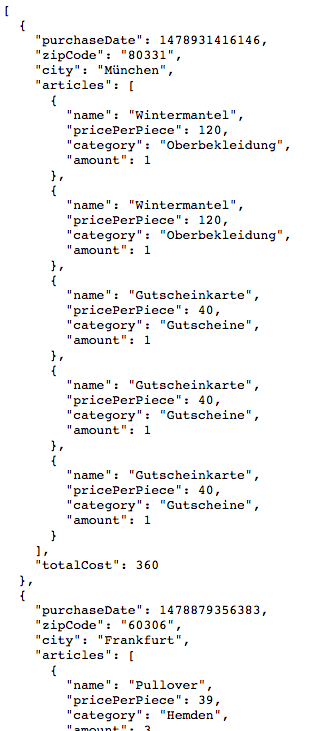
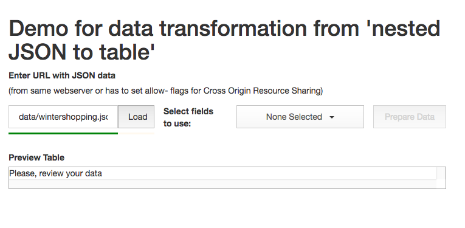
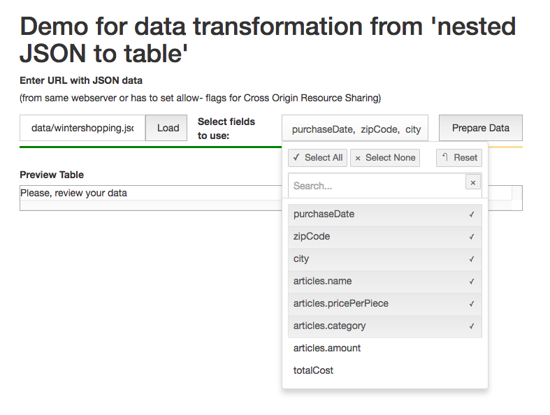
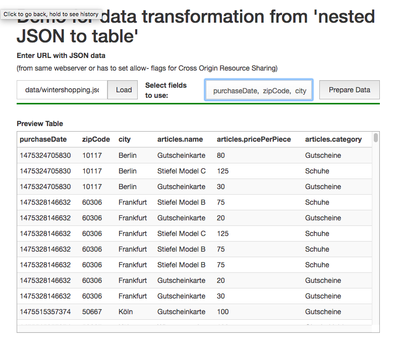

# ds-angular-nested-json-to-table
An angular service to convert a hierarchical nested data structure into a table like representation with selected attributes

**setup**
npm install --save ds-angular-nested-json-to-table

or

bower install --save ds-angular-nested-json-to-table

**demo**
See the simple demo app in 'demo' directory.

Example Data: Array of shopping with nested articles lists 

Workflow Step 1: enter URL and load data

Workflow Step 2: select properties, that should be used for transformation, 1 nested set allowed

Workflow Step 3: generate the final result. Each nested data sets is at top level including selected 'parent' properties.

**usage**

// parse to get metadata

`var metadata = nestedJsonToTableService.getMetaDataFromJson(nestedJson);`

`var selectedProperties = [
            "purchaseDate", "zipCode", "city",
            "articles.name", "articles.pricePerPiece",
            "articles.category", "articles.amount"
];`
        
// convert nested 3D structure to relational table like representation, will be stored in service

`nestedJsonToTableService.transformNestedDataToORM(nestedJson);`

// get transformed tables

`var resultArray = nestedJsonToTableService.getItemsWithSelectedProperties(selectedProperties);`
    

See test-cases for details.

**test**
run `npm test`

**known issues**
- only can generate result table with single nested set selected. fails, if multiple different nested sets are selected (no Cartesian grid)
- currently synchronous, promises/async to come
- only basic error handling
- tests currently in NPM only, due to dependencies with testrunners, which are not available at bower